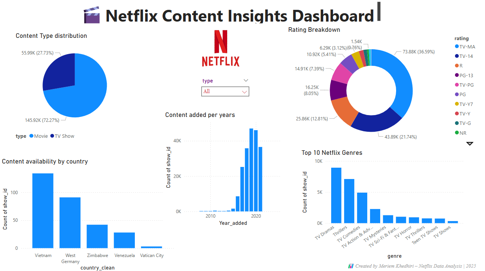

# 🎬 Netflix Movies & TV Shows Power BI Dashboard

This project explores and visualizes the Netflix Movies and TV Shows dataset using **Power BI**. The dashboard presents insights about content type, genres, release trends, and country availability to help understand Netflix’s global streaming catalog.



---

## 📌 Project Goals

- Analyze Netflix content by **type**, **genre**, **country**, and **rating**
- Visualize **release trends** over time
- Create an interactive and shareable **Power BI dashboard**
- Showcase data storytelling and dashboarding skills

---

## 🧹 Data Source

- 📥 Dataset: [Netflix Movies and TV Shows on Kaggle](https://www.kaggle.com/datasets/shivamb/netflix-shows)
- Original Columns:
  - `show_id`, `type`, `title`, `director`, `cast`, `country`, `date_added`, `release_year`, `rating`, `duration`, `listed_in`, `description`

---

## 🛠️ Data Cleaning & Transformation

Performed in **Power Query**:
- Removed null and empty records
- Split multi-genre entries in `listed_in` into separate **rows**
- Cleaned whitespace and standard formats in `country`, `rating`, `duration`
- Extracted `year_added` from `date_added`

---

## 📊 Dashboard Features

| Insight | Visual Type |
|--------|--------------|
| Movie vs TV Show Distribution | Pie Chart |
| Content Added Over Time | Column Chart |
| Top Genres | Bar Chart |
| Content by Country | Map / Bar Chart |
| Rating Distribution | Donut Chart |
| Interactive Filters (Slicers) | By Type, Country, Genre, Year |

---

## 📌 Tools Used

- **Power BI Desktop**
- **Power Query Editor**
- **DAX (basic measures)**
- **GitHub** for version control and showcasing

---

## 🧠 Insights Discovered

- 📈 Netflix has added more content consistently over the years, peaking around 2019–2020.
- 🎭 Drama and International TV are among the top genres.
- 🌍 The US, India, and the UK have the most content available.
- 🎥 Movies dominate the catalog compared to TV Shows.

---

## 🌐 Online Version

> 🔗 [Click here to view the dashboard in Power BI Service](#)  
(https://app.powerbi.com/groups/me/reports/6a0a7ea0-7d36-4ba1-8be7-4bfa141ea4d6/62a051fa0758dfd825ec?experience=power-bi)

---

## ✍️ Author

**Mariam Khedhiri**  
_Data Enthusiast | Power BI Learner | Aspiring Data Analyst_

📫 [LinkedIn](https://www.linkedin.com/in/mariem-khediri/) 

---

## 📁 File Structure

```bash
Netflix-PowerBI-Dashboard/
│
├── Netflix_PowerBI_Dashboard.pbix     # Power BI file
├── README.md                          # Project summary
└──  dashboard-overview.png         # Dashboard image preview
